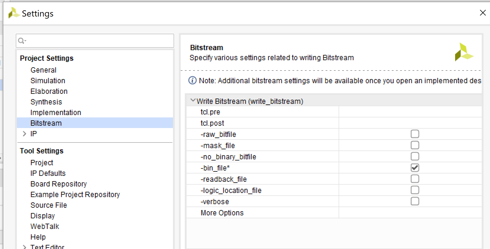
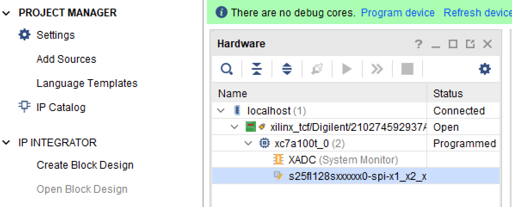

# Nexys4_Keyboard
## LED And


```verilog
module Led(
    input [1:0] sw,
    output [0:0] led
    );
    
    assign led[0] = sw[0] & sw[1];
    
    
endmodule
 
```


Synthesis > Implementation Bitstream

s25fl128sxxxxxx0-spi-x1_x2_x4

